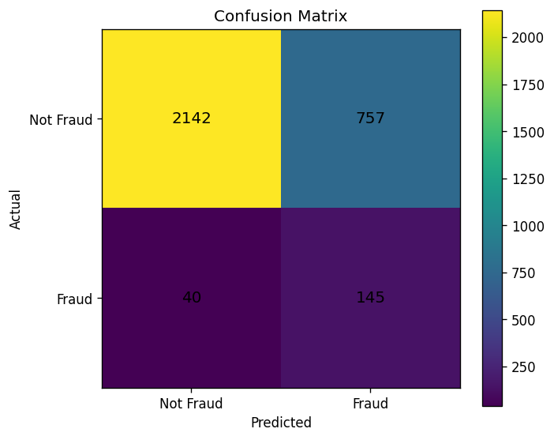
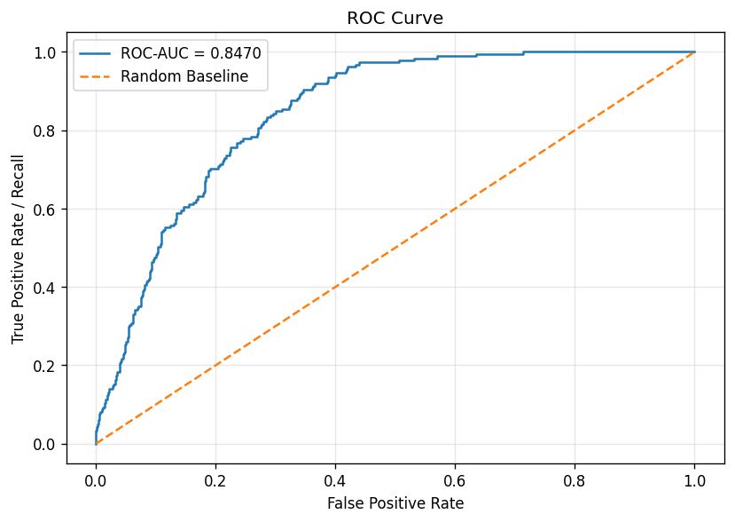
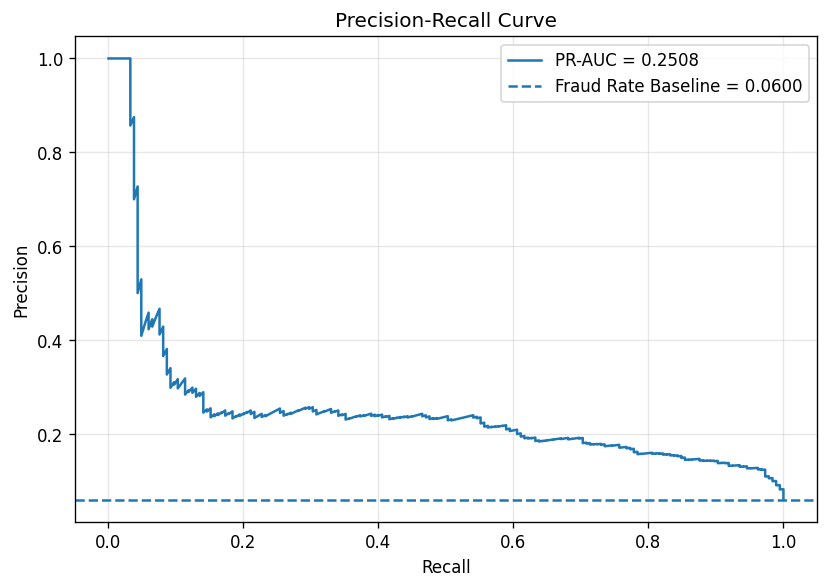
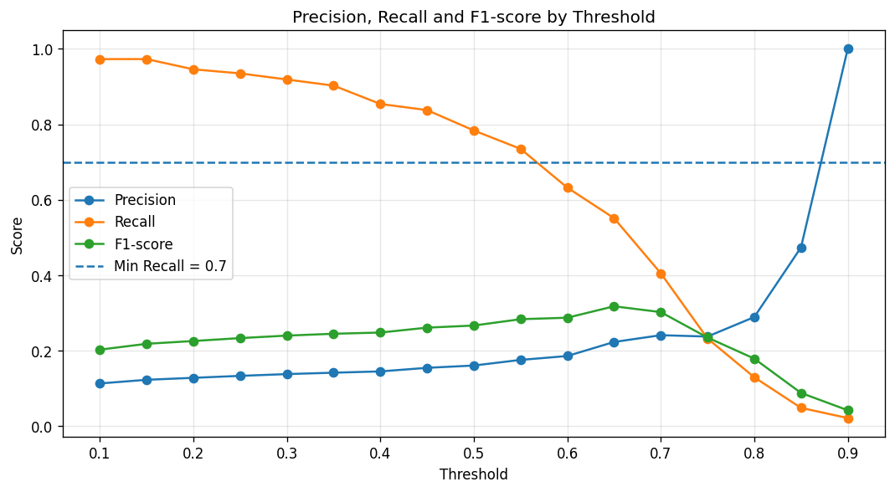
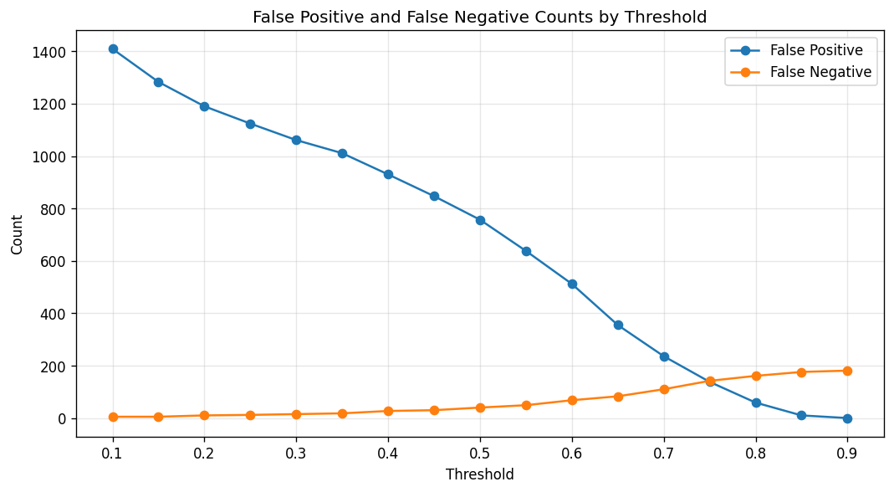
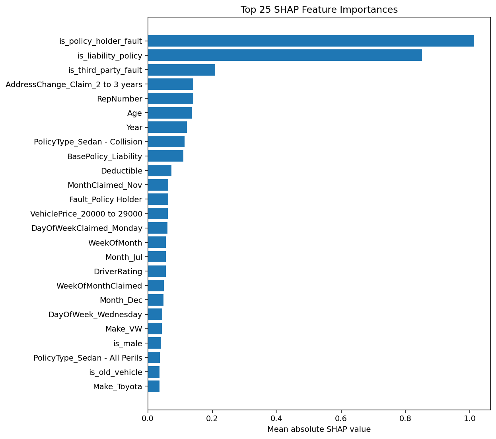
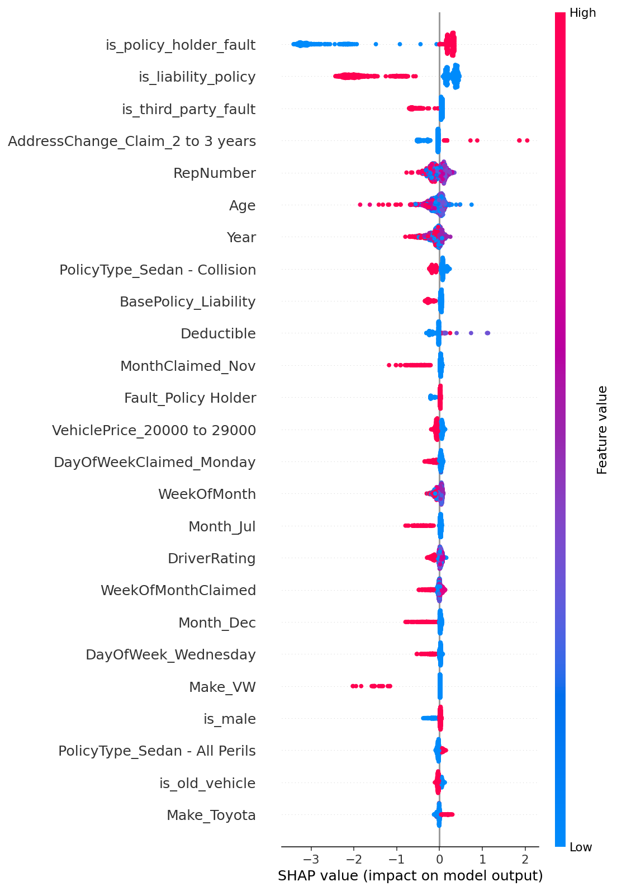
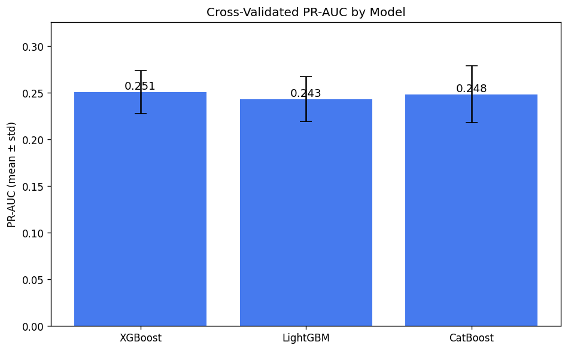
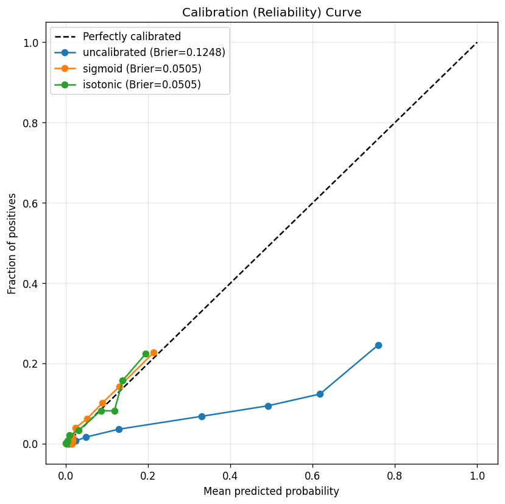
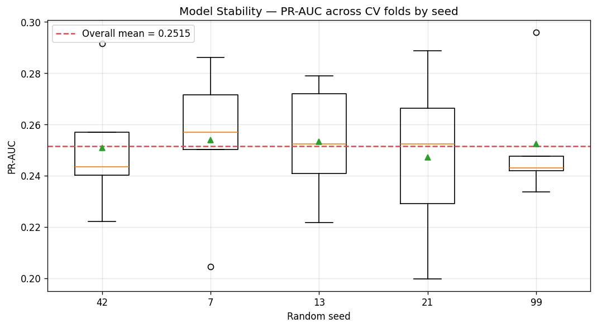

# Vehicle Insurance Claim Fraud Detection with XGBoost, SHAP and FastAPI

## 1. Project Overview

This project is an end-to-end machine learning system for detecting potentially fraudulent vehicle insurance claims.

The system uses historical claim, policyholder, vehicle, accident and policy-related information to estimate the probability that a claim is fraudulent. Instead of only returning a binary fraud / not fraud label, the project provides:

- Fraud probability score
- Fraud / not fraud prediction
- Risk level
- Business recommendation
- Threshold-based decision logic
- SHAP-based explainability for single claim predictions
- FastAPI service for real-time and batch scoring
- CSV / Excel file upload support for bulk prediction

The goal is to simulate a realistic fraud scoring system that could help insurance claim investigation teams prioritize suspicious claims.

---

## 2. Business Problem

Insurance companies receive many claim requests every day. Only a small percentage of these claims are fraudulent, but fraud cases can create serious financial losses.

Manually reviewing every claim is costly and inefficient. A machine learning model can support the fraud investigation process by assigning a risk score to each claim.

The model can help business teams answer questions such as:

- Which claims are more likely to be fraudulent?
- Which claims should be prioritized for manual investigation?
- How many claims will be flagged depending on the selected threshold?
- What are the most important factors behind a suspicious claim?
- How can investigation workload be reduced without missing too many fraud cases?

This project focuses not only on model training, but also on building a deployable and explainable fraud detection system.

---

## 3. Dataset

The project uses the `fraud_oracle.csv` dataset.

Dataset summary:

| Item | Value |
|---|---:|
| Rows | 15,420 |
| Columns | 33 |
| Target column | `FraudFound_P` |
| Non-fraud cases | 14,497 |
| Fraud cases | 923 |
| Fraud ratio | ~5.99% |

Target variable:

```text
FraudFound_P
```

Target meaning:

```text
0 = Not Fraud
1 = Fraud
```

This is a highly imbalanced binary classification problem. Since fraud cases represent only about 6% of the dataset, accuracy alone is not a reliable metric.

---

## 4. Main Features in the Dataset

The dataset includes several types of variables.

### Claim and Date Information

```text
Month
WeekOfMonth
DayOfWeek
MonthClaimed
WeekOfMonthClaimed
DayOfWeekClaimed
Year
```

### Policyholder Information

```text
Sex
MaritalStatus
Age
AgeOfPolicyHolder
```

### Vehicle Information

```text
Make
VehicleCategory
VehiclePrice
AgeOfVehicle
NumberOfCars
```

### Policy Information

```text
PolicyType
BasePolicy
Deductible
Days_Policy_Accident
Days_Policy_Claim
```

### Claim Investigation Information

```text
Fault
PoliceReportFiled
WitnessPresent
AgentType
NumberOfSuppliments
AddressChange_Claim
PastNumberOfClaims
DriverRating
RepNumber
```

---

## 5. Project Architecture

The project is designed as a modular machine learning system.

```text
Vehicle Insurance Claim Fraud Detection/
│
├── data/
│   ├── raw/
│   │   └── fraud_oracle.csv
│   │
│   └── processed/
│
├── notebooks/
│   ├── 01_eda.ipynb
│   ├── 02_model_experiments.ipynb
│   └── 03_shap_analysis.ipynb
│
├── src/
│   ├── config.py
│   ├── data_check.py
│   ├── eda_report.py
│   ├── feature_engineering.py
│   ├── preprocessing.py
│   ├── train.py
│   ├── evaluate.py
│   ├── threshold_tuning.py
│   ├── explain.py
│   ├── predict.py
│   │
│   ├── cv_utils.py              # shared CV / imbalance / cost helpers
│   ├── hyperparameter_tuning.py # RandomizedSearchCV + cross-validation
│   ├── model_comparison.py      # XGBoost vs LightGBM vs CatBoost
│   ├── calibration.py           # probability calibration
│   └── stability.py             # repeated-CV stability testing
│
├── api/
│   ├── __init__.py
│   ├── schemas.py
│   ├── file_utils.py
│   ├── model_service.py
│   ├── security.py             # optional API-key auth
│   ├── maintenance.py          # prediction-output retention cleanup
│   └── main.py
│
├── artifacts/
│   ├── preprocessor.pkl
│   ├── preprocessed_data.pkl
│   ├── feature_names.json
│   ├── raw_feature_columns.json
│   ├── model.pkl
│   ├── metrics.json
│   ├── threshold.json
│   └── model_training_summary.json
│
├── reports/
│   ├── eda/
│   │   └── eda_report.html
│   │
│   └── model/
│       ├── model_evaluation_report.html
│       ├── threshold_tuning_report.html
│       ├── shap_report.html
│       ├── confusion_matrix.png
│       ├── roc_curve.png
│       ├── precision_recall_curve.png
│       ├── threshold_precision_recall_f1.png
│       ├── threshold_error_counts.png
│       ├── threshold_predicted_fraud_count.png
│       ├── shap_summary.png
│       ├── shap_feature_importance_bar.png
│       └── shap_feature_importance.csv
│
├── outputs/
│   └── predictions/
│
├── tests/
│   ├── conftest.py
│   ├── test_feature_engineering.py
│   ├── test_predict_logic.py
│   ├── test_preprocessing.py
│   ├── test_threshold_tuning.py
│   ├── test_explain.py
│   ├── test_file_utils.py
│   ├── test_cv_utils.py
│   ├── test_stability.py
│   ├── test_model_improvement_builders.py
│   ├── test_security.py
│   ├── test_maintenance.py
│   ├── test_integration_pipeline.py
│   └── test_api.py
│
├── requirements.txt
├── requirements-dev.txt
├── pytest.ini
├── README.md
├── Dockerfile
└── .gitignore
```

---

## 6. End-to-End Workflow

The project workflow is:

```text
Raw CSV Dataset
      ↓
Data Check
      ↓
EDA HTML Report
      ↓
Feature Engineering
      ↓
Preprocessing
      ↓
XGBoost Model Training
      ↓
Model Evaluation
      ↓
Threshold Tuning
      ↓
SHAP Explainability
      ↓
Prediction Functions
      ↓
FastAPI Deployment
      ↓
CSV / Excel Batch Prediction
```

---

## 7. Installation

### 7.1 Create Virtual Environment

```powershell
python -m venv vehicle-fraud-venv
```

Activate the environment:

```powershell
vehicle-fraud-venv\Scripts\activate
```

### 7.2 Install Dependencies

```powershell
pip install -r requirements.txt
```

Dependencies are pinned to exact versions in `requirements.txt` for
reproducible installs:

```text
pandas==2.3.3
numpy==2.0.2
scikit-learn==1.6.1
xgboost==2.1.4
lightgbm==4.6.0
catboost==1.2.10
shap==0.49.1
matplotlib==3.9.4
seaborn==0.13.2
fastapi==0.128.8
uvicorn==0.39.0
pydantic==2.13.4
joblib==1.5.3
python-multipart==0.0.20
scipy==1.13.1
openpyxl==3.1.5
xlrd==2.0.2
```

To also install the testing tools (`pytest`, `httpx`), use the dev requirements:

```powershell
pip install -r requirements-dev.txt
```

See [Section 9: Testing](#9-testing) for how to run the test suite.

---

## 8. How to Run the Project

### Step 1: Data Check

```powershell
python src\data_check.py
```

This script checks:

- Dataset shape
- Column names
- Missing values
- Duplicate rows
- Target distribution
- Data types
- Unique values per column

---

### Step 2: Create EDA Report

```powershell
python src\eda_report.py
```

This generates a detailed HTML report:

```text
reports/eda/eda_report.html
```

Open the report:

```powershell
start reports\eda\eda_report.html
```

The EDA report includes:

- Dataset overview
- Target imbalance analysis
- Data quality alerts
- Column-level profiling
- Numeric variable profiling
- Categorical variable profiling
- Missing value analysis
- Correlation analysis
- Fraud rate by important features
- High-risk category analysis
- Modeling recommendations

---

### Step 3: Run Feature Engineering

```powershell
python src\feature_engineering.py
```

The feature engineering module is designed with a registry-based structure. New feature groups can be added easily using the `@register_feature_step` decorator.

Example:

```python
@register_feature_step(
    name="new_feature_group",
    description="Creates new custom fraud-related features."
)
def add_new_features(df):
    df = df.copy()
    df["new_feature"] = ...
    return df
```

Current engineered features include:

```text
Age_Zero_Flag
is_policy_holder_fault
is_third_party_fault
is_no_police_report
is_police_report_filed
is_no_witness
is_witness_present
is_external_agent
is_internal_agent
has_address_change
is_recent_address_change
is_early_policy_accident
is_policy_accident_none
is_early_policy_claim
is_policy_claim_none
has_past_claims
has_multiple_past_claims
has_more_than_4_past_claims
is_high_vehicle_price
is_low_vehicle_price
is_old_vehicle
is_new_vehicle
is_utility_vehicle
is_sport_vehicle
has_multiple_cars
is_all_perils_policy
is_collision_policy
is_liability_policy
is_high_deductible
is_young_driver
is_senior_driver
is_male
is_female
```

---

### Step 4: Preprocessing

```powershell
python src\preprocessing.py
```

This script:

- Applies feature engineering
- Separates features and target
- Removes ID columns such as `PolicyNumber`
- Performs stratified train-test split
- Applies numeric imputation
- Applies categorical one-hot encoding
- Saves preprocessing artifacts

Generated artifacts:

```text
artifacts/preprocessor.pkl
artifacts/preprocessed_data.pkl
artifacts/feature_names.json
artifacts/raw_feature_columns.json
```

Important preprocessing decisions:

- `FraudFound_P` is used as target.
- `PolicyNumber` is excluded from model features.
- `Age = 0` is treated as suspicious and handled with `Age_Zero_Flag`.
- `MonthClaimed = 0` and `DayOfWeekClaimed = 0` are converted to `Unknown`.
- Train/test split is stratified to preserve fraud ratio.

---

### Step 5: Train XGBoost Model

```powershell
python src\train.py
```

This script:

- Loads preprocessed train/test data
- Calculates `scale_pos_weight` for class imbalance
- Trains an `XGBClassifier`
- Saves the trained model

Generated artifacts:

```text
artifacts/model.pkl
artifacts/model_training_summary.json
```

The model uses XGBoost because:

- It performs well on tabular datasets
- It can model non-linear relationships
- It handles feature interactions effectively
- It supports imbalance handling with `scale_pos_weight`
- It works well with SHAP explainability

---

### Step 6: Evaluate Model

```powershell
python src\evaluate.py
```

This script evaluates the model using the default threshold of `0.50`.

Generated outputs:

```text
artifacts/metrics.json
reports/model/model_evaluation_report.html
reports/model/confusion_matrix.png
reports/model/roc_curve.png
reports/model/precision_recall_curve.png
```

Open the evaluation report:

```powershell
start reports\model\model_evaluation_report.html
```

Initial evaluation result:

| Metric | Value |
|---|---:|
| Threshold | 0.50 |
| Accuracy | 0.7416 |
| Precision | 0.1608 |
| Recall | 0.7838 |
| F1-score | 0.2668 |
| ROC-AUC | 0.8470 |
| PR-AUC | 0.2508 |

Confusion matrix:

| Type | Count |
|---|---:|
| True Negative | 2142 |
| False Positive | 757 |
| False Negative | 40 |
| True Positive | 145 |

Interpretation:

- The model catches approximately 78% of actual fraud cases.
- Precision is low because many non-fraud claims are flagged as fraud.
- This is expected in imbalanced fraud detection problems.
- Threshold tuning is needed to manage the trade-off between recall and investigation workload.

## Model Evaluation Visuals

### Confusion Matrix



### ROC Curve



### Precision-Recall Curve



---
### Step 7: Threshold Tuning

```powershell
python src\threshold_tuning.py
```

This script compares thresholds between `0.10` and `0.90`.

It calculates:

- Precision
- Recall
- F1-score
- False positives
- False negatives
- True positives
- True negatives
- Predicted fraud count

Generated outputs:

```text
artifacts/threshold.json
artifacts/threshold_tuning_results.json
reports/model/threshold_tuning_report.html
reports/model/threshold_precision_recall_f1.png
reports/model/threshold_error_counts.png
reports/model/threshold_predicted_fraud_count.png
```

Open threshold tuning report:

```powershell
start reports\model\threshold_tuning_report.html
```

Selected threshold:

| Metric | Value |
|---|---:|
| Selected threshold | 0.55 |
| Precision | 0.1757 |
| Recall | 0.7351 |
| F1-score | 0.2836 |
| False Positive | 638 |
| False Negative | 49 |
| True Positive | 136 |
| True Negative | 2261 |

Business-oriented threshold strategy:

```text
Select the threshold that maximizes precision while keeping recall >= 0.70.
```

Why threshold `0.55` was selected:

- It keeps recall above 70%.
- It reduces false positives compared to the default threshold of 0.50.
- It improves F1-score.
- It reduces manual investigation workload.

Comparison with default threshold:

| Metric | Threshold 0.50 | Threshold 0.55 |
|---|---:|---:|
| Precision | 0.1608 | 0.1757 |
| Recall | 0.7838 | 0.7351 |
| F1-score | 0.2668 | 0.2836 |
| False Positive | 757 | 638 |
| False Negative | 40 | 49 |
| True Positive | 145 | 136 |

Business interpretation:

```text
Threshold 0.55 reduces false positives by 119 cases compared to threshold 0.50,
while missing 9 additional fraud cases.
```

## Threshold Tuning Visuals

### Precision, Recall and F1-score by Threshold



### Error Counts by Threshold



---


### Step 8: SHAP Explainability

```powershell
python src\explain.py
```

This script creates global SHAP explanations and a local sample explanation.

Generated outputs:

```text
reports/model/shap_report.html
reports/model/shap_summary.png
reports/model/shap_feature_importance_bar.png
reports/model/shap_feature_importance.csv
```

Open SHAP report:

```powershell
start reports\model\shap_report.html
```

The SHAP module supports:

### Global Explainability

Global SHAP analysis answers:

```text
Which features are most important for the model overall?
```

Generated outputs:

- SHAP summary plot
- SHAP feature importance bar chart
- SHAP feature importance CSV
- SHAP HTML report

### Local Explainability

Local SHAP analysis answers:

```text
Why did the model classify this specific claim as fraud or not fraud?
```

The API supports local explanation through:

```text
POST /predict-explain
```
## SHAP Explainability Visuals

### SHAP Feature Importance



### SHAP Summary Plot


---

## Model Improvement & Validation

Beyond the single baseline XGBoost model, the project includes a set of optional
modules for improving and validating the model. They all read the same
`artifacts/preprocessed_data.pkl` and use the same imbalance handling, so they
are directly comparable. All of them use **stratified K-fold cross-validation**
and optimise **PR-AUC** (`average_precision`), the right metric for a ~6% fraud
rate.

Shared settings live in [`src/config.py`](src/config.py) (`CV_FOLDS`,
`CV_SCORING`, cost weights, stability seeds); shared helpers live in
[`src/cv_utils.py`](src/cv_utils.py).

### Step 9: Hyperparameter Tuning

```powershell
python src\hyperparameter_tuning.py
```

`RandomizedSearchCV` over the XGBoost hyperparameters (40 candidates × 5-fold CV),
scored on PR-AUC. Class imbalance is fixed via `scale_pos_weight`
(**cost-sensitive learning**), so the search focuses on tree/regularisation
parameters. Saves `artifacts/best_params.json` and the ranked
`artifacts/hyperparameter_search_results.json`.

> **Wired into training:** the next time you run `python src\train.py`, it
> automatically loads `best_params.json` and trains the final model with the
> tuned hyperparameters. If the file is absent or invalid it falls back to the
> manually-tuned defaults. The chosen source is recorded as
> `hyperparameter_source` in `artifacts/model_training_summary.json`.

### Step 10: Model Comparison (XGBoost vs LightGBM vs CatBoost)

```powershell
python src\model_comparison.py
```

Cross-validates all three gradient-boosting libraries under identical CV and
imbalance handling, reporting PR-AUC / ROC-AUC / F1 (mean ± std) plus a held-out
test score. Saves `artifacts/model_comparison.json`,
`reports/model/model_comparison.png` and an HTML report.

### Step 11: Probability Calibration

```powershell
python src\calibration.py
```

Wraps the model with `CalibratedClassifierCV` (sigmoid and isotonic) and measures
**Brier score** + log loss before/after, with a reliability curve. A
`scale_pos_weight` model ranks well but is badly miscalibrated; calibration makes
the predicted probabilities trustworthy for risk banding. Saves
`artifacts/calibrated_model.pkl`, `artifacts/calibration_results.json` and
`reports/model/calibration_curve.png`.

### Step 12: Stability Testing

```powershell
python src\stability.py
```

Repeats stratified K-fold CV across several random seeds and reports the spread
of PR-AUC (std, range, coefficient of variation) with a verdict. Low spread means
the model generalises consistently rather than depending on a lucky split. Saves
`artifacts/stability_results.json` and `reports/model/stability_pr_auc.png`.

### Results Summary

Representative results on this dataset (CV PR-AUC, mean ± std):

| Check | Result |
|-------|--------|
| Hyperparameter tuning (best XGBoost) | **0.257** PR-AUC (vs ~0.251 baseline) |
| XGBoost | 0.251 ± 0.023 |
| LightGBM | 0.243 ± 0.024 |
| CatBoost | 0.248 ± 0.031 |
| Calibration (Brier, lower is better) | 0.125 → **0.051** (sigmoid) |
| Stability | mean 0.252, CV ≈ 0.10 → *moderately stable* |

The three libraries perform comparably, with XGBoost slightly ahead — confirming
the original choice. The largest practical win is calibration, which more than
halves the Brier score. Exact numbers vary slightly with the random seed.

### Model Improvement Visuals

#### Model Comparison (cross-validated PR-AUC)



Each bar is the mean PR-AUC over the 5 cross-validation folds; the error bars
show ±1 standard deviation. The three gradient-boosting libraries land within
each other's error bars, so no model is clearly better — XGBoost's small lead,
combined with it already being wired into the production pipeline, justifies
keeping it as the default. The absolute level (~0.25) reflects how hard this
imbalanced problem is, not a bug in any single model.

#### Probability Calibration (reliability curve)



The dashed diagonal is perfect calibration: points on it mean "when the model
says 0.3, about 30% of those claims really are fraud." The **uncalibrated**
curve (trained with `scale_pos_weight`) sits far from the diagonal — the
imbalance weighting inflates probabilities, so the raw scores are good for
*ranking* but not for *probability*. After **sigmoid/isotonic** calibration the
curve hugs the diagonal and the Brier score drops from 0.125 to ~0.051, making
the probabilities trustworthy for risk bands and expected-cost thresholds.

#### Stability (PR-AUC across seeds)



Each box is the distribution of fold PR-AUC for one random seed; the red dashed
line is the overall mean. The boxes overlap heavily and the coefficient of
variation is ~0.10, so the model's performance does not hinge on a lucky split —
it is *moderately stable*. A model whose boxes jumped around wildly would be a
red flag that the score was an artefact of one particular fold.

---

## 9. Testing

The project ships with an automated test suite under `tests/`, runnable with
[pytest](https://docs.pytest.org/). The tests are split into two layers so the
suite stays green even on a fresh checkout (model artifacts are gitignored):

- **Unit tests** — pure logic, no trained model or dataset required. They always run.
- **Integration / API tests** — exercise the real artifacts (`model.pkl`,
  `preprocessor.pkl`, `threshold.json`, ...). These are **automatically skipped**
  when the artifacts are not present, and run once you have executed the
  preprocessing → training → threshold-tuning steps.

### 9.1 Test Layout

```text
tests/
├── conftest.py                        # path setup, shared fixtures, artifact-skip marker
├── test_feature_engineering.py        # safe_* helpers + each feature step + full pipeline
├── test_predict_logic.py              # risk levels, recommendations, column alignment, threshold loader
├── test_preprocessing.py              # feature/target split, one-hot encoding, imputation, feature names
├── test_threshold_tuning.py           # threshold sweep + business selection strategy + fallback
├── test_explain.py                    # SHAP format handling, raw-column mapping, reason text
├── test_file_utils.py                 # CSV/Excel upload parsing, validation, size limit
├── test_cv_utils.py                   # imbalance weights, cost model, CV splitter, score summaries
├── test_stability.py                  # coefficient of variation, stability summary + verdict
├── test_model_improvement_builders.py # search space + model builders (tuning/comparison/calibration)
├── test_security.py                   # optional API-key dependency
├── test_maintenance.py                # prediction-output retention cleanup
├── test_integration_pipeline.py       # end-to-end predict / batch / SHAP with the real model
└── test_api.py                        # FastAPI endpoints (incl. auth, size limit) via TestClient
```

### 9.2 Test Count

The suite currently contains **160 tests**. Each `test_*` function counts as one
test, and parametrized tests count once per case, so the numbers reflect the
number of scenarios checked rather than the number of functions written.

| File | Tests |
|------|------:|
| `test_feature_engineering.py` | 23 |
| `test_predict_logic.py` | 23 |
| `test_cv_utils.py` | 16 |
| `test_api.py` | 15 |
| `test_explain.py` | 13 |
| `test_file_utils.py` | 12 |
| `test_stability.py` | 11 |
| `test_preprocessing.py` | 10 |
| `test_model_improvement_builders.py` | 10 |
| `test_threshold_tuning.py` | 9 |
| `test_integration_pipeline.py` | 7 |
| `test_security.py` | 6 |
| `test_maintenance.py` | 5 |
| **Total** | **160** |

On a fresh checkout without trained artifacts, the 22 integration/API tests
(`test_integration_pipeline.py` + `test_api.py`) are **skipped**, so 138 tests run.

To see the per-file breakdown yourself:

```bash
pytest --collect-only
```

### 9.3 What Is Covered

| Area | Examples |
|------|----------|
| Feature engineering | Engineered flags are correct; `safe_*` helpers return 0 (not crash) on missing columns; pipeline is deterministic and does not mutate its input |
| Prediction logic | Risk-level boundaries, business recommendations, target/ID dropping, train/inference column alignment, threshold fallback to the default |
| Preprocessing | Numeric/categorical split, dense one-hot with `handle_unknown="ignore"`, median imputation, consistent train/test widths |
| Threshold tuning | Recall is monotonic in the threshold, confusion counts sum to N, "max precision with recall ≥ 0.7" strategy and its best-F1 fallback |
| Explainability | SHAP list/2D/3D output normalization, one-hot → raw-column inference (longest prefix wins), human-readable reason text |
| File I/O | CSV and Excel reading, latin-1 fallback, rejection of empty files and unsupported formats |
| CV / cost utils | `scale_pos_weight` and balanced class weights, asymmetric cost model, stratified-fold ratio preservation, score summaries |
| Model improvement | Search-space ranges, tuning/comparison/calibration/stability model builders, CatBoost clone-safety regression guard |
| Security | API-key dependency: disabled without env, rejects missing/wrong key, accepts valid key, health stays open |
| Maintenance | Retention cleanup removes only expired files, respects the glob, no-ops on missing dir / negative age |
| API | `/health`, `/predict`, `/predict-explain`, `/batch-predict`, `/predict-file` round-trip + download, auth, upload size limit, 400/404 handling |

### 9.4 Install Test Dependencies

```bash
pip install -r requirements-dev.txt
```

This installs the runtime requirements plus `pytest` and `httpx` (used by
FastAPI's `TestClient`).

### 9.5 Run the Tests

```bash
# Run everything
pytest

# Verbose
pytest -v

# A single file
pytest tests/test_feature_engineering.py

# Only the always-on unit tests (skip integration/API)
pytest --ignore=tests/test_integration_pipeline.py --ignore=tests/test_api.py
```

With trained artifacts present, the full suite runs (unit + integration + API).
Without them, the integration and API tests are reported as **skipped** rather
than failing.

---

## 10. FastAPI Service

Start the API:

```powershell
uvicorn api.main:app --reload
```

Open Swagger UI:

```text
http://127.0.0.1:8000/docs
```

Available endpoints:

```text
GET  /
GET  /health
POST /predict
POST /predict-explain
POST /batch-predict
POST /predict-file
GET  /download-predictions/{file_name}
```

### Production Hardening

The service is configured for safe operation, not just local demos:

- **Lifespan startup** — artifacts are loaded via a FastAPI `lifespan` handler
  (the deprecated `@app.on_event("startup")` has been removed).
- **Optional API-key auth** — set the `API_KEY` environment variable to require
  an `X-API-Key` header on all prediction/download endpoints. When `API_KEY` is
  unset, auth is **disabled** (local dev and tests work unchanged). `/` and
  `/health` are always open.
- **Structured errors, no leaks** — endpoints log the full traceback
  server-side and return a generic message. Client mistakes on `/predict-file`
  (bad format, empty/oversized file, no rows) return **400**; unexpected
  failures return **500**. Raw exception text is never sent to the client.
- **Request logging** — a middleware logs every request as
  `METHOD path -> status (latency ms)`.
- **CORS** — configurable allowed origins via `ALLOWED_ORIGINS` (defaults to `*`;
  credentials are enabled automatically only when explicit origins are listed).
- **Upload size limit** — `/predict-file` rejects uploads larger than
  `MAX_UPLOAD_SIZE_MB` (default 10 MB) with a 400.
- **Output retention** — prediction CSVs in `outputs/predictions/` older than
  `PREDICTION_RETENTION_HOURS` (default 24 h) are deleted on startup and after
  each `/predict-file` call, so the directory does not grow forever.

#### Configuration (environment variables)

| Variable | Default | Purpose |
|----------|---------|---------|
| `API_KEY` | *(unset)* | Enables API-key auth when set; required `X-API-Key` value |
| `ALLOWED_ORIGINS` | `*` | Comma-separated CORS origins |
| `MAX_UPLOAD_SIZE_MB` | `10` | Max `/predict-file` upload size |
| `PREDICTION_RETENTION_HOURS` | `24` | Age after which prediction CSVs are purged |
| `LOG_LEVEL` | `INFO` | Logging verbosity |

Example (PowerShell), enabling auth and a stricter limit:

```powershell
$env:API_KEY = "my-secret-key"
$env:MAX_UPLOAD_SIZE_MB = "5"
uvicorn api.main:app --reload
```

Then call a protected endpoint with the header:

```powershell
curl.exe -X POST "http://127.0.0.1:8000/predict" `
  -H "X-API-Key: my-secret-key" `
  -H "Content-Type: application/json" `
  -d '{}'
```

---

## 11. API Endpoints

### 11.1 Health Check

```text
GET /health
```

Example response:

```json
{
  "status": "ok",
  "model_loaded": true,
  "preprocessor_loaded": true,
  "threshold": 0.55
}
```

---

### 11.2 Single Claim Prediction

```text
POST /predict
```

Example request:

```json
{
  "Month": "Dec",
  "WeekOfMonth": 5,
  "DayOfWeek": "Wednesday",
  "Make": "Honda",
  "AccidentArea": "Urban",
  "DayOfWeekClaimed": "Friday",
  "MonthClaimed": "Dec",
  "WeekOfMonthClaimed": 5,
  "Sex": "Male",
  "MaritalStatus": "Single",
  "Age": 35,
  "Fault": "Policy Holder",
  "PolicyType": "Sedan - Collision",
  "VehicleCategory": "Sedan",
  "VehiclePrice": "20000 to 29000",
  "PolicyNumber": 10001,
  "RepNumber": 12,
  "Deductible": 400,
  "DriverRating": 3,
  "Days_Policy_Accident": "more than 30",
  "Days_Policy_Claim": "more than 30",
  "PastNumberOfClaims": "2 to 4",
  "AgeOfVehicle": "6 years",
  "AgeOfPolicyHolder": "31 to 35",
  "PoliceReportFiled": "No",
  "WitnessPresent": "No",
  "AgentType": "External",
  "NumberOfSuppliments": "none",
  "AddressChange_Claim": "no change",
  "NumberOfCars": "1 vehicle",
  "Year": 1994,
  "BasePolicy": "Collision"
}
```

Example response:

```json
{
  "fraud_probability": 0.6234,
  "threshold": 0.55,
  "prediction": 1,
  "prediction_label": "Fraud",
  "risk_level": "Medium",
  "recommendation": "Additional document check recommended"
}
```

---

### 11.3 Single Claim Prediction with SHAP Explanation

```text
POST /predict-explain
```

Example response:

```json
{
  "fraud_probability": 0.6234,
  "threshold": 0.55,
  "prediction": 1,
  "prediction_label": "Fraud",
  "risk_level": "Medium",
  "recommendation": "Additional document check recommended",
  "top_reasons": [
    {
      "processed_feature": "Fault_Policy Holder",
      "raw_column": "Fault",
      "category_value": "Policy Holder",
      "feature_value": 1.0,
      "shap_value": 0.245312,
      "absolute_shap_value": 0.245312,
      "direction": "increases_fraud_risk",
      "reason": "Fault being 'Policy Holder' increased the fraud risk."
    }
  ]
}
```

This endpoint is useful when a business user wants to understand why the model produced a specific prediction.

---

### 11.4 Batch JSON Prediction

```text
POST /batch-predict
```

Example request:

```json
{
  "claims": [
    {
      "Month": "Dec",
      "WeekOfMonth": 5,
      "DayOfWeek": "Wednesday",
      "Make": "Honda",
      "AccidentArea": "Urban",
      "DayOfWeekClaimed": "Friday",
      "MonthClaimed": "Dec",
      "WeekOfMonthClaimed": 5,
      "Sex": "Male",
      "MaritalStatus": "Single",
      "Age": 35,
      "Fault": "Policy Holder",
      "PolicyType": "Sedan - Collision",
      "VehicleCategory": "Sedan",
      "VehiclePrice": "20000 to 29000",
      "PolicyNumber": 10001,
      "RepNumber": 12,
      "Deductible": 400,
      "DriverRating": 3,
      "Days_Policy_Accident": "more than 30",
      "Days_Policy_Claim": "more than 30",
      "PastNumberOfClaims": "2 to 4",
      "AgeOfVehicle": "6 years",
      "AgeOfPolicyHolder": "31 to 35",
      "PoliceReportFiled": "No",
      "WitnessPresent": "No",
      "AgentType": "External",
      "NumberOfSuppliments": "none",
      "AddressChange_Claim": "no change",
      "NumberOfCars": "1 vehicle",
      "Year": 1994,
      "BasePolicy": "Collision"
    }
  ]
}
```

Example response:

```json
{
  "count": 1,
  "results": [
    {
      "Month": "Dec",
      "WeekOfMonth": 5,
      "fraud_probability": 0.6234,
      "threshold": 0.55,
      "prediction": 1,
      "prediction_label": "Fraud",
      "risk_level": "Medium",
      "recommendation": "Additional document check recommended"
    }
  ]
}
```

---

### 11.5 CSV / Excel File Prediction

```text
POST /predict-file
```

This endpoint supports:

```text
.csv
.xlsx
.xls
```

The endpoint:

1. Reads uploaded CSV or Excel file.
2. Scores all rows.
3. Saves the result as a CSV file.
4. Returns summary statistics and a preview.
5. Provides a download URL.

The response does not return all rows directly, because large files can make the browser or Swagger UI fail.

Example response:

```json
{
  "filename": "fraud_oracle.csv",
  "input_rows": 15420,
  "input_columns": 33,
  "result_count": 15420,
  "fraud_count": 4200,
  "not_fraud_count": 11220,
  "fraud_rate_percent": 27.24,
  "risk_level_counts": {
    "Low": 8000,
    "Medium": 5200,
    "High": 2220
  },
  "output_file": "fraud_predictions_20260524_162530_a1b2c3d4.csv",
  "download_url": "/download-predictions/fraud_predictions_20260524_162530_a1b2c3d4.csv",
  "preview_rows": 20,
  "preview": [
    {
      "Month": "Dec",
      "WeekOfMonth": 5,
      "fraud_probability": 0.6234,
      "threshold": 0.55,
      "prediction": 1,
      "prediction_label": "Fraud",
      "risk_level": "Medium",
      "recommendation": "Additional document check recommended"
    }
  ]
}
```

The prediction output is saved under:

```text
outputs/predictions/
```

Example output file:

```text
outputs/predictions/fraud_predictions_20260524_162530_a1b2c3d4.csv
```

---

### 11.6 Download Prediction Output

```text
GET /download-predictions/{file_name}
```

Example:

```text
http://127.0.0.1:8000/download-predictions/fraud_predictions_20260524_162530_a1b2c3d4.csv
```

This downloads the generated prediction CSV file.

---

## 12. Output Columns

For CSV / Excel file prediction, the output file contains the original input columns plus:

```text
fraud_probability
threshold
prediction
prediction_label
risk_level
recommendation
```

Example:

| PolicyNumber | Age | Fault | fraud_probability | prediction_label | risk_level | recommendation |
|---:|---:|---|---:|---|---|---|
| 10001 | 35 | Policy Holder | 0.6234 | Fraud | Medium | Additional document check recommended |
| 10002 | 48 | Third Party | 0.0812 | Not Fraud | Low | Standard claim process |

---

## 13. Risk Level Logic

The model returns a fraud probability between 0 and 1.

Risk level is assigned using the following logic:

```text
fraud_probability < 0.30
→ Low Risk

0.30 <= fraud_probability < 0.70
→ Medium Risk

fraud_probability >= 0.70
→ High Risk
```

Recommendations:

| Risk Level | Prediction | Recommendation |
|---|---:|---|
| Low | 0 | Standard claim process |
| Medium | 0 | Monitor claim and continue standard process |
| Medium | 1 | Additional document check recommended |
| High | 1 | Manual investigation required |

---

## 14. Why Accuracy Is Not Enough

The dataset is highly imbalanced:

```text
Fraud cases: ~6%
Non-fraud cases: ~94%
```

If a model predicts every claim as not fraud, it can still achieve about 94% accuracy. However, such a model would be useless because it would catch no fraud cases.

Therefore, this project focuses on:

```text
Precision
Recall
F1-score
ROC-AUC
PR-AUC
Confusion Matrix
False Positives
False Negatives
```

Important business meaning:

```text
False Positive:
A normal claim is incorrectly flagged as fraud.
This increases manual investigation workload.

False Negative:
A fraudulent claim is missed by the model.
This can create financial loss.
```

---

## 15. Model Interpretation

The project uses SHAP for explainability.

SHAP helps answer:

```text
Why did the model assign this fraud probability?
Which features increased fraud risk?
Which features decreased fraud risk?
Which features are globally important?
```

There are two types of SHAP analysis:

### Global SHAP

Global SHAP explains overall model behavior.

Example question:

```text
Which features are generally most important for fraud prediction?
```

Generated files:

```text
reports/model/shap_summary.png
reports/model/shap_feature_importance_bar.png
reports/model/shap_feature_importance.csv
reports/model/shap_report.html
```

### Local SHAP

Local SHAP explains one specific prediction.

Example question:

```text
Why was this claim classified as fraud?
```

Available through:

```text
POST /predict-explain
```

---

## 16. Project Strengths

This project demonstrates:

- End-to-end machine learning workflow
- Insurance fraud detection use case
- Tabular data modeling
- Class imbalance handling
- XGBoost model training
- Threshold tuning
- Business-oriented evaluation
- Explainable AI with SHAP
- FastAPI deployment
- CSV / Excel batch scoring
- Modular feature engineering
- Production-oriented project structure
- Model improvement & validation (hyperparameter tuning, multi-library comparison, calibration, cross-validation, stability testing)
- Production-hardened API (lifespan startup, optional API-key auth, structured errors, request logging, CORS, upload size limit, output retention)
- Automated test suite (pytest) covering feature engineering, preprocessing, prediction, threshold tuning, explainability and the API

---

## 17. Current Limitations

This project is a learning and portfolio project. It has some limitations:

1. The dataset is public and may not fully represent real insurance claim behavior.
2. Some columns may not be available at the real-time scoring stage in a real production system.
3. Some variables may create potential leakage depending on the real-world claim workflow.
4. The current model is trained on a single static dataset.
5. No production monitoring (data/prediction drift) is implemented yet.
6. A calibrated model is produced (`calibration.py`) but the API still serves the uncalibrated ranking model.
7. CSV / Excel prediction does not currently add SHAP explanations to every row, to keep batch scoring fast and output files clean.
8. API-key auth is single-key and header-based; no per-user accounts, rate limiting or OAuth.

> Several earlier limitations have since been addressed: the API now supports
> optional **API-key authentication**, **structured error handling** without
> leaking internals, **request logging**, **CORS**, an **upload size limit**,
> **prediction-output retention**, and **probability calibration** is available
> as a module. See *FastAPI Service → Production Hardening* and the *Changelog*.

---

## 18. Future Improvements

Possible next steps:

### Model Improvements

Implemented (see *Model Improvement & Validation* above):

- ✅ Hyperparameter tuning (`RandomizedSearchCV`)
- ✅ LightGBM and CatBoost comparison
- ✅ Probability calibration
- ✅ Cost-sensitive learning (`scale_pos_weight` / balanced weights)
- ✅ Cross-validation (stratified K-fold)
- ✅ Model stability testing (repeated-seed CV)
- ✅ Wiring tuned `best_params.json` into `train.py`

Still open:

- More advanced feature engineering
- Serving the calibrated model from the API (probabilities, not just ranking)
- Optuna-based search and cost-based threshold optimisation

### Evaluation Improvements

- Lift chart
- Gain chart
- Cost-based threshold optimization
- Business simulation of investigation workload
- Fraud savings estimation

### Explainability Improvements

- SHAP explanations for selected high-risk batch predictions
- Business-friendly explanation templates
- LLM-generated explanation summaries
- Separate investigator report

### API Improvements

- Authentication
- Request logging
- Error logging
- Async batch scoring
- File size validation
- Background jobs for large files
- Download history
- API versioning

### MLOps Improvements

- Docker support
- MLflow experiment tracking
- Model registry
- Data drift monitoring
- Prediction drift monitoring
- Automated retraining pipeline
- CI/CD pipeline running the pytest suite on every push
- Expanded test coverage (more edge cases, coverage reporting)

### UI Improvements

- Streamlit dashboard
- Upload CSV/Excel from UI
- Show top risky claims
- Filter by risk level
- Download scored file
- Display SHAP explanation for selected claim

---

## 19. Example Commands

Run all main steps in order:

```powershell
python src\data_check.py
python src\eda_report.py
python src\feature_engineering.py
python src\preprocessing.py
python src\train.py
python src\evaluate.py
python src\threshold_tuning.py
python src\explain.py
```

Optional model improvement & validation steps:

```powershell
python src\hyperparameter_tuning.py
python src\model_comparison.py
python src\calibration.py
python src\stability.py
```

Start API:

```powershell
uvicorn api.main:app --reload
```

Open Swagger:

```text
http://127.0.0.1:8000/docs
```

---

## 20. Example PowerShell API Test

### Health Check

```powershell
curl.exe -X GET "http://127.0.0.1:8000/health"
```

### CSV File Prediction

```powershell
curl.exe -X POST "http://127.0.0.1:8000/predict-file" `
  -F "file=@data/raw/fraud_oracle.csv" `
  -F "preview_rows=20"
```

---

## 21. Technical Stack

| Area | Tools |
|---|---|
| Programming Language | Python |
| Data Processing | Pandas, NumPy |
| Machine Learning | Scikit-learn, XGBoost, LightGBM, CatBoost |
| Explainability | SHAP |
| Visualization | Matplotlib, Seaborn |
| API | FastAPI, Uvicorn, Pydantic |
| Testing | pytest, httpx |
| Serialization | Joblib, JSON |
| File Support | CSV, Excel, OpenPyXL |
| Reports | HTML, PNG, CSV |

---

## 22. Summary

This project builds a complete fraud detection system for vehicle insurance claims.

It covers:

```text
EDA
Feature engineering
Preprocessing
Model training
Evaluation
Threshold tuning
Explainability
Prediction
FastAPI deployment
CSV / Excel batch scoring
```

The main objective is not only to train a machine learning model, but also to create a realistic and explainable fraud scoring service that can support claim investigation workflows.

The final system can be used to:

- Score a single claim
- Explain a single prediction
- Score multiple claims from JSON
- Upload CSV / Excel files for batch prediction
- Download scored prediction results as CSV

This makes the project suitable as a portfolio-level, end-to-end machine learning deployment project.

---

## 23. Changelog

Recent improvements layered on top of the original baseline:

### Testing
- Added a **pytest** suite (`tests/`) — **160 tests** across unit + integration/API
  layers, with `pytest.ini` and `requirements-dev.txt` (`pytest`, `httpx`).
  Integration/API tests auto-skip when trained artifacts are absent.

### Reproducibility
- **Pinned all dependencies** to exact versions in `requirements.txt`; added
  `lightgbm`, `catboost`, `seaborn`.

### Model improvement & validation (`src/`)
- `cv_utils.py` — shared stratified-CV, imbalance weights and cost helpers.
- `hyperparameter_tuning.py` — `RandomizedSearchCV` (PR-AUC, 5-fold).
- `model_comparison.py` — XGBoost vs LightGBM vs CatBoost under identical CV.
- `calibration.py` — sigmoid/isotonic calibration + Brier / reliability curve.
- `stability.py` — repeated-seed CV stability testing.
- `train.py` now **auto-loads `best_params.json`** (tuned hyperparameters) with a
  safe fallback to manual defaults.

### API hardening (`api/`)
- Replaced deprecated `@app.on_event("startup")` with a **`lifespan`** handler.
- **Optional API-key auth** (`api/security.py`) — enabled via `API_KEY` env.
- **Structured error handling** — server-side logging, generic client messages,
  `400` for client errors vs `500` for unexpected failures (no leaked internals).
- **Request-logging middleware**, **CORS** (`ALLOWED_ORIGINS`).
- **Upload size limit** (`MAX_UPLOAD_SIZE_MB`) on `/predict-file`.
- **Prediction-output retention** (`api/maintenance.py`, `PREDICTION_RETENTION_HOURS`)
  — expired CSVs purged on startup and after each file scoring.
- API version bumped to **1.1.0**.

### Documentation
- README updated throughout: architecture tree, Testing section, Model
  Improvement & Validation section (with visuals), Production Hardening +
  configuration table, strengths, limitations and this changelog.